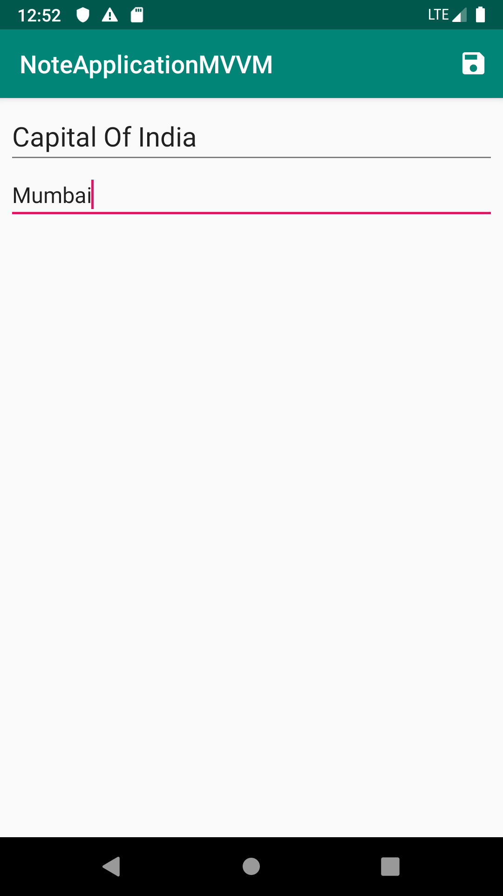

     
 
## NoteApplication

This is a Simple Note Application that is built in Kotlin following google app architecture guidelines and MVVM methodology.

# Implementation steps

1. Add Room and LifeCycle Dependencies
2. Setup Room
3. Creating a Repository Class
4. Implement ViewModel
5. Add Adapter and RecyclerView
6. Populate the Database
7. Connect UI and Data
8. Create AddNoteActivity

# Google Guide to App Architecture

# ScreenShots

  
Special mention to https://proandroiddev.com/building-an-android-app-using-android-architecture-components-room-viewmodel-and-livedata-702a0af899ae article for the motivation and idea.

<a href="https://www.linkedin.com/in/mrunalupadhyay/">
   
